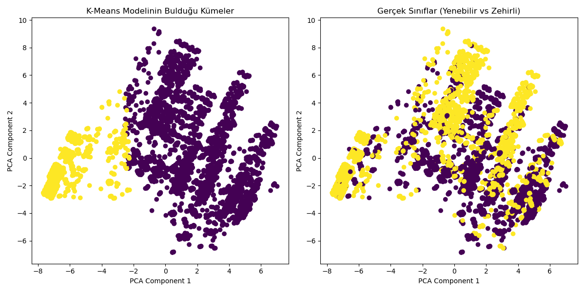

# Mantar Sınıflandırma ve Veri Madenciliği

Bu depo, mantarları yenilebilir veya zehirli olarak sınıflandırmayı amaçlayan ekip tabanlı akademik bir makine öğrenmesi projesini içermektedir. Genel proje iş akışı; veri ön işleme, kümeleme ve gözetimli sınıflandırma (supervised classification) aşamalarından oluşmaktadır.

**Katkım hakkında not:** Bu proje ortak bir takım çalışmasıdır. Benim özel rolüm, veri kümeleme ve boyut indirgeme konularına odaklanarak gözetimsiz öğrenme (unsupervised learning) iş akışını tasarlamak ve kodlamaktı.

## ⚙️ Kullanılan Teknolojiler

* **Dil:** Python
* **Kütüphaneler:** Pandas, NumPy, Matplotlib, Scikit-Learn
* **Algoritmalar:** K-Means Kümeleme, Temel Bileşenler Analizi (PCA)

## 🚀 Projedeki Sorumluluklarım

* **Veri Ön İşleme:** Eksik veriler mod (tepe değer) kullanılarak dolduruldu ve kategorik öznitelikleri sayısal verilere dönüştürmek için Label Encoding (Etiket Kodlama) uygulandı.
* **Kümeleme Analizi:** Verileri temelde yatan örüntülere göre gruplandırmak amacıyla K-Means kümeleme algoritması (`n_clusters=2`) entegre edildi.
* **Boyut İndirgeme:** Veri setindeki 22 farklı özniteliği 2 boyutlu görselleştirme yapabilmek adına 2 temel bileşene (principal component) düşürmek için PCA yöntemi kullanıldı.
* **Doğrulama:** Kümeleme performansını değerlendirmek amacıyla, K-Means modelinin küme tahminleri ile veri setindeki gerçek etiketler çapraz tablo (cross-tabulation) yöntemiyle karşılaştırıldı.

## 📊 Görselleştirmeler

